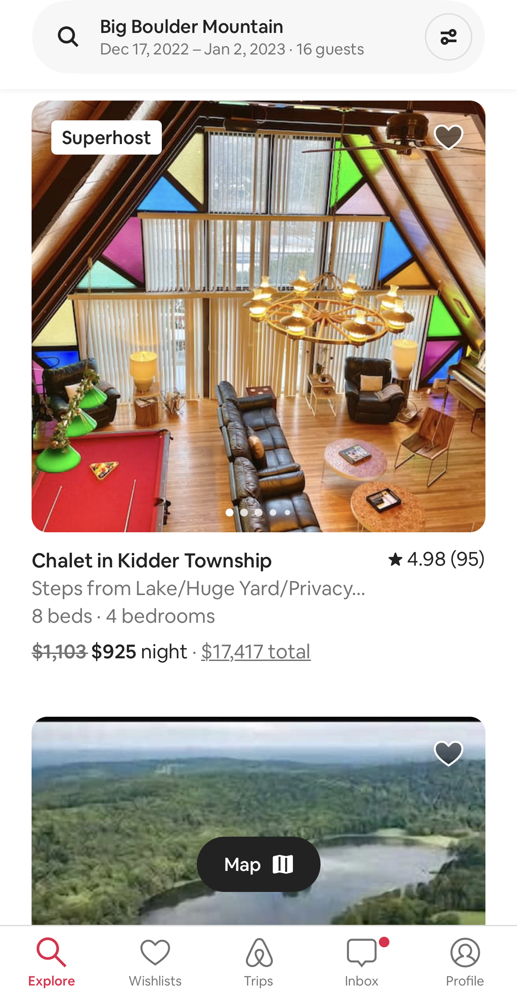

# "RecyclerView for displaying lists of data" Reading Notes 📖

1. What makes a RecyclerView dynamic?
    - It makes it easy to efficiently display large sets of data. You supply the data and define how each item looks, and the RecyclerView library creates the elements when they're needed.
    - RecyclerView reuses the view for new items that have scrolled onscreen.
2. Share a screenshot of a recycler view in an application you use!
   - Airbnb when you search for a place you get a recycled view of every property. 
   - 

## References 

- [RecyclerView for displaying lists of data](https://developer.android.com/guide/topics/ui/layout/recyclerview#java)