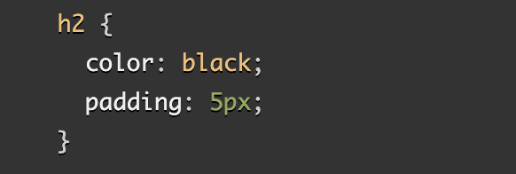

# "JavaScript Basics" Reading Notes 📖

## HTML Text Fundamentals, and HTML Advanced Text Formatting

1. **Why is it important to use semantic elements in our HTML?**
   - Semantics tells us what the function will be, and what the expected value is. We need to ensure that we use the correct elements, giving it the correct meaning, function or appearance. Additionally, the page will perform poorly if for example, the `<h1>` is not used for the heading, in terms of Search Engine Optimization, and Screen Reader softwares. HTML should be coded to represent the data that will be populated and not based on its default presentation styling. For presentation, you should use CSS.
2. **How many levels of headings are there in HTML?**
   - There are six heading elements: `<h1>`, `<h2>`, `<h3>`, `<h4>`, `<h5>`, and `<h6>`. Each element represents a different level of content in the document; `<h1>` represents the main heading, `<h2>` represents subheadings, `<h3>` represents sub-subheadings, and so on.
3. **What are some uses for the `` and `` elements?**
   - Some of the uses for `` can be dates, or mathematical equations. For `` =, it can be used for formulas, and mathematical equations. 
4. **When using the `<abbr>` element, what attribute must be added to provide the full expansion of the term?**
   - To wrap around abbreviation or acronyms, provide a full expansion of the term in plain text on first use, along with `<abbr>` to mark up abbreviation

## How CSS is Structured

1. **What are ways we can apply CSS to our HTML?**
   - We can apply CSS to HTML with:
     - *An external stylesheet* contains CSS in a separate file with a .css extension. This is the most common and useful method of bringing CSS to a document. You can link a single CSS file to multiple web pages, styling all of them with the same CSS stylesheet.
     - *An internal stylesheet* resides within an HTML document. To create an internal stylesheet, you place CSS inside a `<style>` element contained inside the HTML `<head>`.
     - *Inline styles* are CSS declarations that affect a single HTML element, contained within a style attribute.
2. **Why should we avoid using inline styles?**
   - Because it is the opposite of a best practice. First, it is the least efficient implementation of CSS for maintenance. One styling change might require multiple edits within a single web page. Second, inline CSS also mixes (CSS) presentational code with HTML and content, making everything more difficult to read and understand. Separating code and content makes maintenance easier for all who work on the website.
3. **Review the block of code below and answer the following questions:**

   1. *What is representing the selector?*
      - **h2** is Representing the selector
   2. *Which components are the CSS declarations?*
      - `color: black;`, and `padding: 5px;` are the CSS declarations in the above CSS block
   3. *Which components are considered properties?*
      - `color`, and `padding` are the properties in the above CSS block

## JS Basics and Conditionals

1. **What data type is a sequence of text enclosed in single quote marks?**
    - Data type of text enclosed in single quote marks `''` are strings
2. **List 4 types of JavaScript operators.**
    - Addition `+`
    - Subtraction `-`
    - Multiplication`*`
    - Division `/`
    - Assignment `=`
    - Strict equality `===`
    - Not `!`
    - Does-not-equal `!==`
3. **Describe a real world Problem you could solve with a Function.**
    - 

Description lists use a different wrapper than the other list types — <dl>; in addition each term is wrapped in a <dt> (description term) element, and each description is wrapped in a <dd> (description definition) element.

Representing computer code
There are a number of elements available for marking up computer code using HTML:
<code>: For marking up generic pieces of computer code.
<pre>: For retaining whitespace (generally code blocks) — if you use indentation or excess whitespace inside your text, browsers will ignore it and you will not see it on your rendered page. If you wrap the text in <pre></pre> tags however, your whitespace will be rendered identically to how you see it in your text editor.
<var>: For specifically marking up variable names.
<kbd>: For marking up keyboard (and other types of) input entered into the computer.
<samp>: For marking up the output of a computer program.
- Use `<pre>`, then `<code>`