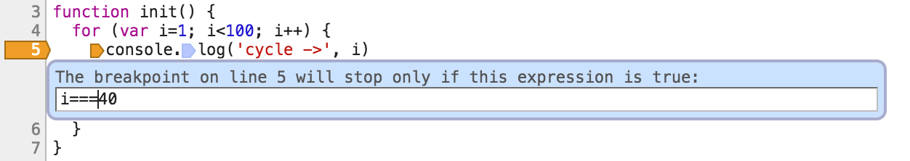
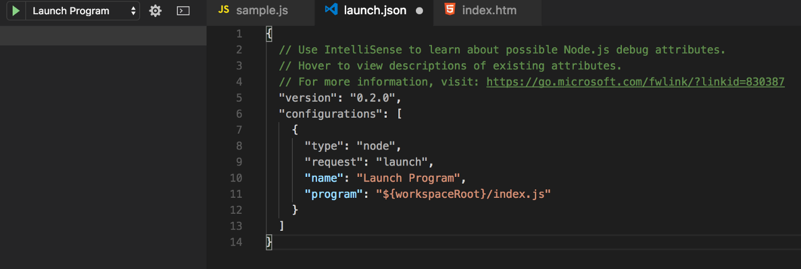

# "Class 10" Reading Notes 📖

## Understanding the JavaScript Call Stack

1. What is a ‘call’?

- The call stack is primarily used for function invocation (call). Since the call stack is single, function(s) execution, is done, one at a time, from top to bottom. It means the call stack is synchronous.

2. How many ‘calls’ can happen at once?
3. What does LIFO mean?

- Last In, First Out, it means that the last function that gets pushed into the stack is the first to be pop out, when the function returns

4. Draw an example of a call stack and the functions that would need to be invoked to generate that call stack.

``` JS
function firstFunction(){
  throw new Error('Stack Trace Error');
}

function secondFunction(){
  firstFunction();
}

function thirdFunction(){
  secondFunction();
}

thirdFunction();

// When the code is run, we get an error. You will notice that the arrangement of the functions as a stack begins with the firstFunction() (which is the last function that got into the stack, and is popped out to throw the error), followed by the secondFunction(), and then the thirdFunction() (which is the first function that gets pushed into the stack when the code is executed).

//A good example:
function firstFunction(){
  console.log("Hello from firstFunction");
}

function secondFunction(){
  firstFunction();
  console.log("The end from secondFunction");
}

secondFunction();

//1. When secondFunction() gets executed, an empty stack frame is created. It is the main (anonymous) entry point of the program.
// 2. secondFunction() then calls firstFunction()which is pushed into the stack.
// 3. firstFunction() returns and prints “Hello from firstFunction” to the console.
// 4. firstFunction() is pop off the stack.
// 5. The execution order then move to secondFunction().
// 6. secondFunction() returns and print “The end from secondFunction” to the console.
// 7. secondFunction() is pop off the stack, clearing the memory.
```

5. What causes a Stack Overflow?

- A stack overflow occurs when there is a recursive function (a function that calls itself) without an exit point. The browser (hosting environment) has a maximum stack call that it can accomodate before throwing a stack error.
For Example:

``` JS
function callMyself(){
  callMyself();
}

callMyself();

//The callMyself() will run until the browser throws a “Maximum call size exceeded”. And that is a stack overflow.
```

## JavaScript error messages

1. What is a ‘reference error’?

- When you try to use a variable that is not yet declared you get this type os errors.

```js
console.log(foo) // Uncaught ReferenceError: foo is not defined
```

2. What is a ‘syntax error’?

- This occurs when you have something that cannot be parsed in terms of syntax, like when you try to parse an invalid object using JSON.parse.

```js
JSON.parse( {'foo': 'bar'} ) // Uncaught SyntaxError: Unexpected token o in JSON at position 1
```

3. What is a ‘range error’?

- Try to manipulate an object with some kind of length and give it an invalid length and this kind of errors will show up.

```js
var foo= []
foo.length = foo.length -1 // Uncaught RangeError: Invalid array length
```

4. What is a ‘type error’?

- This types of errors show up when the types (number, string and so on) you are trying to use or access are incompatible, like accessing a property in an undefined type of variable.

``` js
var foo = {}
foo.bar // undefined
foo.bar.baz // Uncaught TypeError: Cannot read property 'baz' of undefined
```

5. What is a breakpoint?

- Being able to see what has happened before that point you selected to be the breakpoint and you can try and evaluate the next lines to check if everything is outputting what you are expecting.


6. What does the word ‘debugger’ do in your code?

- The breakpoint can also be achieved by putting a debugger statement in your code in the line you want to break.
You can also add conditional breakpoints by right-clicking a previous set breakpoint, which will make your program stop at that point only if a condition is met, this is awesome for when you want to debug huge cycles for specific values. In this example the breakpoint will point stop when the index reaches 40.

Using Node.js with Visual Studio Code you can press the debug tab and add a configuration similar to this:


## Things I want to know more about

I want to know more about managing function invocation call 

## References

- [Understanding the JavaScript Call Stack](https://www.freecodecamp.org/news/understanding-the-javascript-call-stack-861e41ae61d4)
- [JavaScript error Messages](https://codeburst.io/javascript-error-messages-debugging-d23f84f0ae7c)
