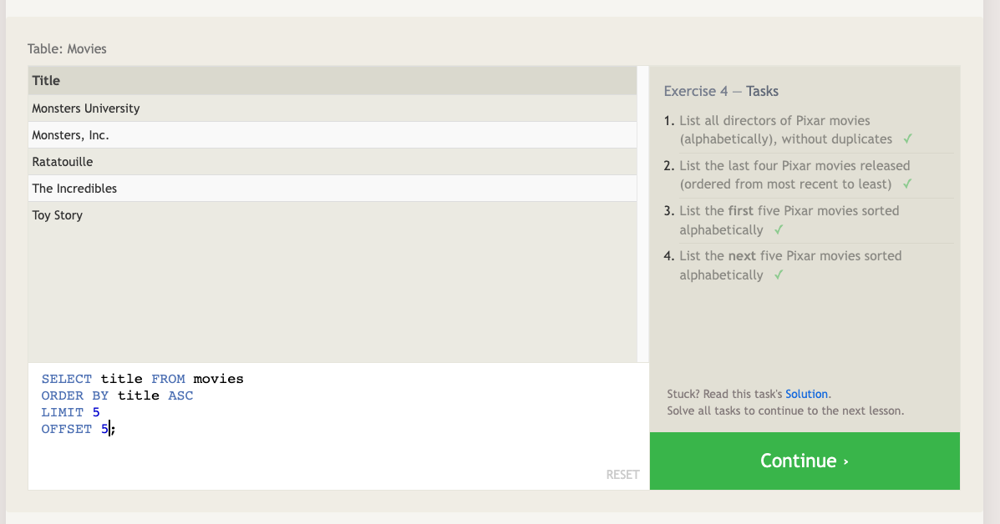

# "SQL" Reading Notes 📖

- Structured Query Language is a relational database that provides storage to many web and mobile applications. With SQL you can select the column and query to find and add data. For more complex searches, when millions of rows of data are available, SQL allows you to use logical keywords and conditional operators to filter data.
- When insering a new column with its value, you can use the `INSERT INTO` `<table>` statement ("column name") `VALUES`("values").
- When updating rows use UPDATE "table name" statement followed by SET "column name" = "value", and if any condition is needed, use the WHERE "condition" statement.
- To delete a row use DELETE FROM "table name" WHERE "conditon".
- To create a table use the following schema:

```

CREATE TABLE "name of table" (
    "column name" "Value"
    "column name" "Value"
    "column name" "Value"
);

```





